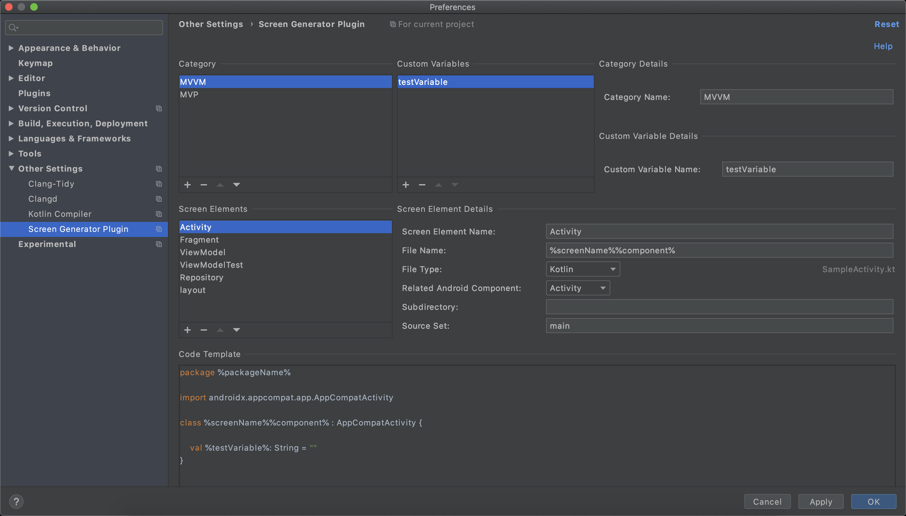
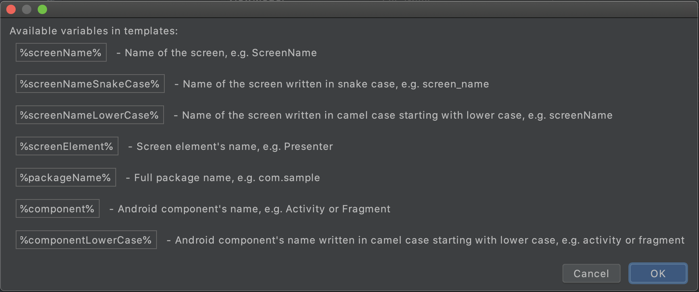
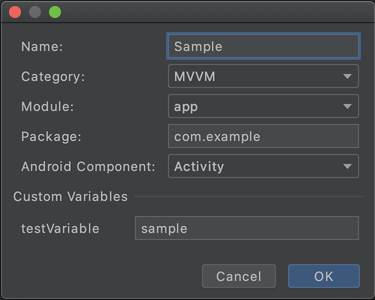

# Screen Generator Plugin

This is an Android Studio plugin, which helps you automate your everyday development by generating all necessary files for your project's architecture when you are creating a new screen.

For example, you are using MVP architecture and you are creating a Main screen. You can set up the plugin to generate for you:
<ul>
<li>MainActivity.kt</li>
<li>MainView.kt</li>
<li>MainPresenter.kt</li>
<li>activity_main.xml</li>
</ul>

And also you can set dynamically changing content of all files depending on screen's name, base Android component and other variables.

## How to install?

You can simply install it in Android Studio in Preferences -> Plugins -> Browse repositories and search for Screen Generator.

Here's also link to plugin: [https://plugins.jetbrains.com/plugin/12020-screen-generator](https://plugins.jetbrains.com/plugin/12020-screen-generator)

## How to use it?

First you need to set up templates of the files that you would like to generate with this plugin. To do that go to Preferences -> Other Settings ->  Screen Generator Plugin. 

This is how the settings screen look like: 

You can have multiple categories of your templates for different architectures or components, e.g. MVP, MVVM etc. For each category you can set up screen elements, which basically are file templates which will be generated for you. 

For each screen element you can define some basic information.

To find out what are available variables to put in your templates, simply click Help link in Settings.

You can also define your own custom variables for each category. Then use it in template - simply put `%myCustomVariable%` and plugin will replace it with value which you provide while generating new screen.

Once you are done, you can create a new screen by clicking File -> New -> Screen from the top menu or simply by right-clicking on any package in your project structure and choosing New -> Screen. 

Feel free to open an issue if you notice any bug or have any feature request!
